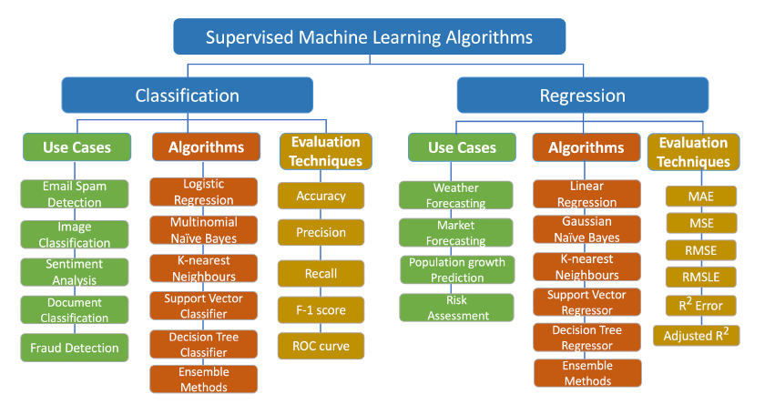

# Machine Learning Algorithms From Scratch Using Python

Welcome to the Machine Learning Algorithms From Scratch Using Python repository! This repository, owned by Muhammad Sheraz, is your comprehensive guide to understanding and implementing machine learning algorithms from scratch in Python. Whether you're a beginner in machine learning or aiming to deepen your understanding, this resource is designed to provide you with in-depth knowledge and practical implementations.

## Table of Contents

- [Introduction](#introduction)
- [Why Implement Machine Learning Algorithms From Scratch?](#why-implement-machine-learning-algorithms-from-scratch)
- [Machine Learning Algorithms](#machine-learning-algorithms)
  - [Linear Regression](#linear-regression)
  - [Logistic Regression](#logistic-regression)
  - [K-Nearest Neighbors (KNN)](#k-nearest-neighbors-knn)
  - [Decision Trees](#decision-trees)
  - [Random Forests](#random-forests)
  - [Support Vector Machines (SVM)](#support-vector-machines-svm)
  - [K-Means Clustering](#k-means-clustering)
  - [Principal Component Analysis (PCA)](#principal-component-analysis-pca)
  - [Naive Bayes Classifier](#naive-bayes-classifier)
  - [Neural Networks](#neural-networks)
- [How to Use](#how-to-use)
- [Contributing](#contributing)
- [License](#license)

## Introduction

Welcome to the world of machine learning! This repository is your gateway to understanding the inner workings of various machine learning algorithms. By implementing these algorithms from scratch in Python, you'll gain a deeper understanding of how they function under the hood, empowering you to become a more proficient machine learning practitioner.

## Why Implement Machine Learning Algorithms From Scratch?

Understanding the internals of machine learning algorithms offers several benefits:

- **Deep Understanding**: Implementing algorithms from scratch helps you understand their intricacies, leading to a deeper comprehension of their strengths, weaknesses, and underlying mathematics.

- **Customization**: Building algorithms from scratch allows you to customize them to suit specific requirements, providing flexibility and control over the learning process.

- **Educational Purposes**: For educational purposes, implementing algorithms from scratch enhances learning and reinforces theoretical knowledge with practical implementations.

- **Debugging and Optimization**: Implementing algorithms yourself enables you to debug and optimize them more effectively, improving performance and efficiency.

## Machine Learning Algorithms

Explore a wide range of machine learning algorithms with detailed explanations and Python implementations:

### Linear Regression

- **Linear Regression**: Linear regression is a fundamental supervised learning algorithm used for modeling the relationship between a dependent variable and one or more independent variables. It works by fitting a straight line to the data points to minimize the sum of squared residuals. You'll understand the underlying concepts and implement both simple and multiple linear regression models from scratch in Python.

### Logistic Regression

- **Logistic Regression**: Logistic regression is another supervised learning algorithm primarily used for binary classification tasks. Unlike linear regression, logistic regression predicts the probability of a binary outcome based on one or more predictor variables. You'll delve into the concepts behind logistic regression and implement it from scratch in Python for binary classification tasks.

### K-Nearest Neighbors (KNN)

- **K-Nearest Neighbors (KNN)**: KNN is a simple and versatile supervised learning algorithm used for both classification and regression tasks. It works by finding the k-nearest data points to the query point and classifying or predicting based on the majority class or average value of its neighbors. You'll implement the KNN algorithm from scratch in Python for both classification and regression tasks.

### Decision Trees

- **Decision Trees**: Decision trees are powerful supervised learning algorithms used for classification and regression tasks. They make decisions by recursively partitioning the feature space into regions that best separate the classes or minimize the variance of the target variable. Learn how decision trees work and implement both classification and regression trees from scratch in Python.

### Random Forests

- **Random Forests**: Random forests are an ensemble learning technique that combines multiple decision trees to improve performance and reduce overfitting. They work by training several decision trees on random subsets of the data and averaging their predictions. Understand ensemble learning principles and implement the random forest algorithm from scratch in Python for classification and regression tasks.

### Support Vector Machines (SVM)

- **Support Vector Machines (SVM)**: SVM is a powerful supervised learning algorithm used for classification and regression tasks. It works by finding the optimal hyperplane that best separates the classes in the feature space while maximizing the margin between them. Dive into the concepts behind SVM and implement it from scratch in Python with detailed explanations.

### K-Means Clustering

- **K-Means Clustering**: K-Means is an unsupervised learning algorithm used for clustering data into distinct groups or clusters. It works by iteratively assigning data points to the nearest centroid and updating the centroids based on the mean of the assigned points. Learn about unsupervised learning principles and implement the K-Means algorithm from scratch in Python for clustering tasks.

### Principal Component Analysis (PCA)

- **Principal Component Analysis (PCA)**: PCA is a popular dimensionality reduction technique used for visualizing high-dimensional data and reducing its complexity. It works by transforming the original features into a new set of orthogonal components that capture the maximum variance in the data. Understand the concepts behind PCA and implement it from scratch in Python for dimensionality reduction and data visualization purposes.

### Naive Bayes Classifier

- **Naive Bayes Classifier**: Naive Bayes is a probabilistic supervised learning algorithm based on Bayes' theorem and the assumption of independence between features. It's commonly used for text classification tasks, such as spam detection and sentiment analysis. Learn about Bayesian classification principles and implement the Naive Bayes classifier from scratch in Python for text classification tasks.

### Neural Networks

- **Neural Networks**: Neural networks are a class of deep learning algorithms inspired by the structure and function of the human brain. They consist of interconnected layers of artificial neurons that process input data and learn complex patterns. Dive into the world of artificial neural networks and implement basic feedforward neural networks from scratch in Python.

## How to Use

To make the most out of this repository:

1. Clone this repository to your local machine using `git clone`.
2. Explore the relevant algorithm folder that interests you.
3. Review the provided Python code implementations.
4. Run the code examples to see how the algorithms work in practice.
5. Experiment with different parameters and datasets to deepen your understanding.
6. Utilize the content as a reference, study guide, or teaching material for machine learning projects or educational purposes.
7. Contribute, report issues, or suggest improvements to enhance the quality of this repository further.

## Get in Touch

If you have any questions, suggestions, or feedback, feel free to create an issue or reach out via email at [sheraz601050@gmail.com](mailto:sheraz601050@gmail.com).

---

## Happy Learning! 📚

I hope you find this repository valuable in your journey to mastering machine learning algorithms. Keep learning, experimenting, and happy coding! 😄

Like the data structures and algorithms repository, this machine learning repository has been meticulously crafted to provide you with a comprehensive understanding of machine learning algorithms. Dive in, explore, and elevate your machine learning skills!
